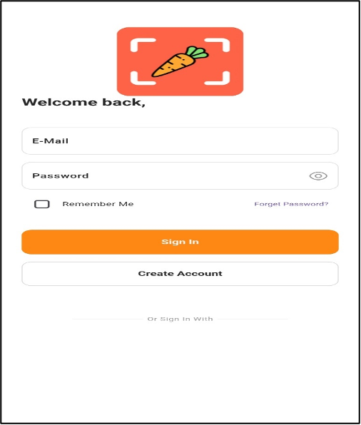
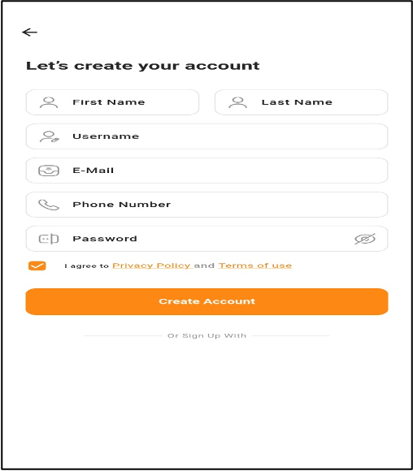
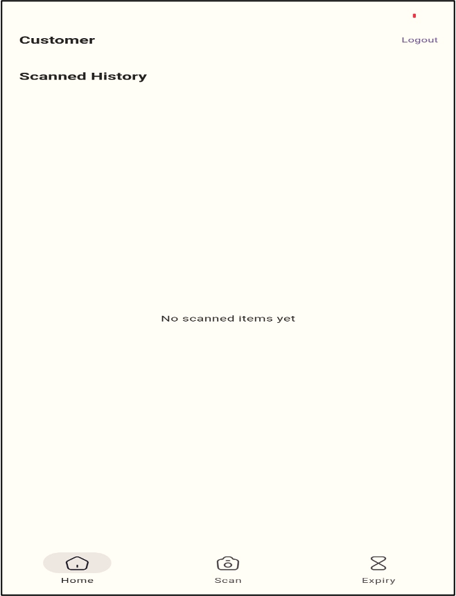
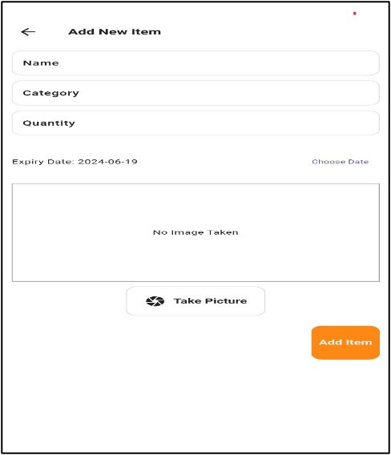
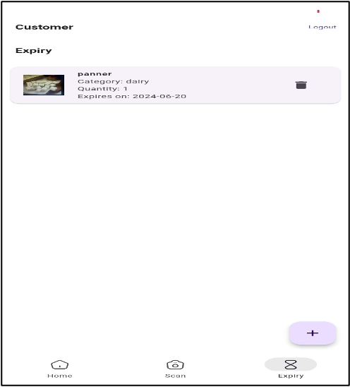
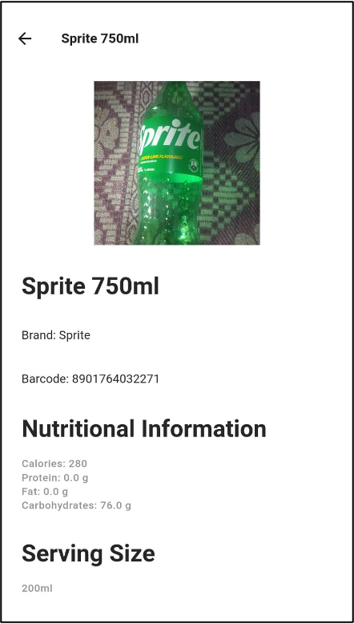
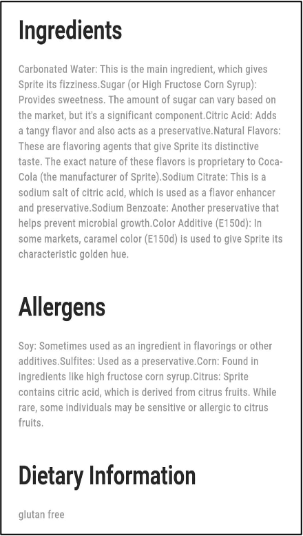
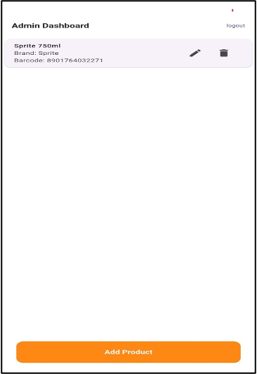
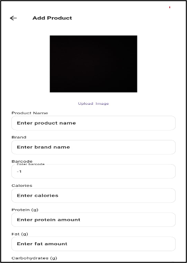
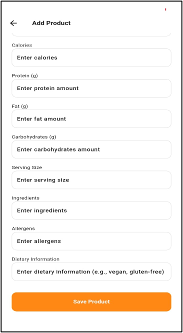

# Nutriscan built with flutter

## Overview

Nutriscan is an application designed to provide users with detailed nutritional and ingredient information by scanning the barcode of food products. The app aims to simplify the process of making informed dietary choices and empower users to better manage their nutritional intake.

## Features

- **Barcode Scanning**: By simply scanning the barcode of a food item, Nutriscan instantly generates data on its ingredients, nutritional content, allergens, and more.
- **User-Friendly Interface**: Presents nutritional information in an easily understandable manner.
- **Expiry Reminder**: Keep track of food items and get reminders before they expire.
- **History Tracking**: Stores scanned items in the user's history using Firebase.

## Technologies Used

- **Frontend**: Flutter
- **Backend**: Firebase

## Project Structure

The project consists of the following main folders:

- `lib`: Contains the Dart code for the Flutter application.
- `assets`: Contains images and other asset files used in the app.
- `android`: Android-specific files and configurations.
- `ios`: iOS-specific files and configurations.

## Setup and Installation

1. Clone the repository:

   ```sh
   git clone https://github.com/yourusername/nutriscan.git
   ```

2. Navigate to the project directory:

   ```sh
   cd nutriscan
   ```

3. Install Flutter dependencies:

   ```sh
   flutter pub get
   ```

4. Set up Firebase:

   - Follow the official [Firebase documentation](https://firebase.google.com/docs/flutter/setup) to configure Firebase for both Android and iOS.

5. Run the app on your preferred device or emulator:
   ```sh
   flutter run
   ```

## Screens

- **Login**:
  
- **Register**:
  
- **Home (Customer)**:
  
- **Reminder**:
  
- **Reminder List**:
  
- **Product**:
  
- **Product1**:
  
- **Admin Dashboard**:
  
- **Add Product**:
  
- **Add Product1**:
  

## Contact Information

For any questions or support related to the project, please contact:

- LinkedIn: [Kishantalekar](https://www.linkedin.com/in/kishan-talekar-2613b8260/)
- Twitter: [Kishantalekar](https://x.com/KishanTalekar)
